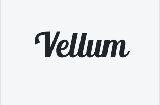
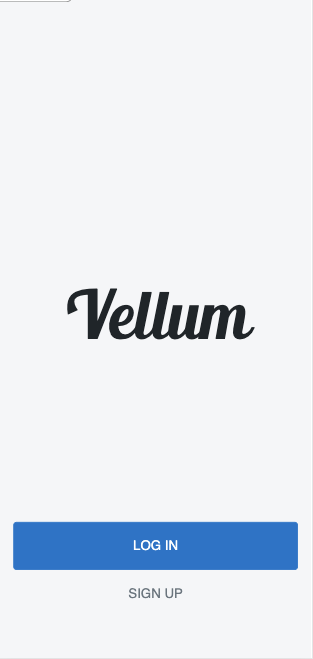
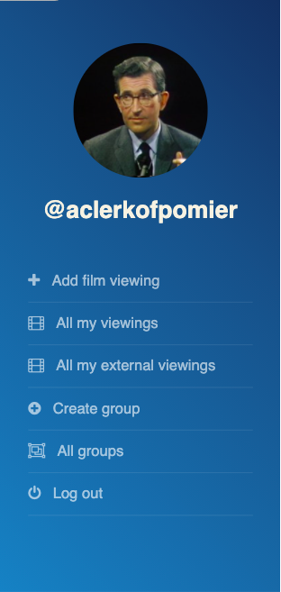
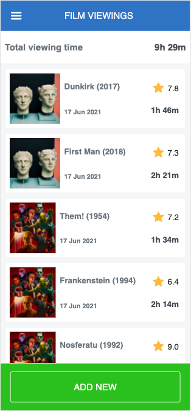
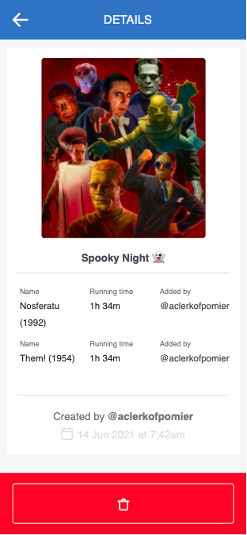

<br />
<p align="center">
  <a href="https://github.com/crgc/vellum">
    
  </a>

  <h3 align="center">Vellum</h3>

  <p align="center">
    This project is part of the Microverse Rails Module.
    <br />
    <a href="https://github.com/crgc/vellum/issues">Report Bug</a>
    ·
    <a href="https://github.com/crgc/vellum/issues">Request Feature</a>
  </p>
</p>

> A mobile-first web app for tracking your favorite films

Vellum lets registered users track their favorite films and group them into categories.

## Live Demo

[vellum-mc.herokuapp.com](https://vellum-mc.herokuapp.com/) (Open in portrait mode or on a mobile browser)

## Getting started

### Prerequisites

1. Ruby (~v2.7.2 or more recent)
2. Rails 6

### Setup

* Clone this repository
```
git clone https://github.com/crgc/vellum.git
```
* Change into folder
```
cd vellum
```
* Install gems
```
bundle install
```
* Set up database
```
rails db:migrate
```
* Install Javascript dependencies
```
yarn install
```

### Run

* Start Rails server
```
rails server
```
* Open your browser in portrait mode at http://localhost:3000/

### Testing with RSpec

* To run the RSpec tests, do the following:

  - run `gem install rspec` in your terminal. This should install rspec globally on your local machine
  - run `rspec --version`. This should display your rspec version if successfully installed
  - run `bundle exec rspec` to see passing and failing tests

### Deployment

Follow this [deployment guide](https://devcenter.heroku.com/articles/getting-started-with-rails6#deploy-your-application-to-heroku) to deploy your application to Heroku.

## Built With

- Ruby
- Rails
- Bootstrap
- [Cloudinary](https://cloudinary.com/)

## Screenshots

  Splash             |  Home
  :-------------------------:|:-------------------------:
    |  

  Films             |  Group
  :-------------------------:|:-------------------------:
    |  

## Authors

👤  **Carlos González**
- GitHub: [@crgc](https://github.com/crgc)
- Twitter: [@aclerkofpomier](https://twitter.com/aclerkofpomier)
- LinkedIn: [Carlos González](https://www.linkedin.com/in/carlosrmgonzalez/)

## 🤝 Contributing

Contributions, issues, and feature requests are welcome!

Feel free to check the [issues page](https://github.com/crgc/vellum/issues).

## Show your support

Give a ⭐️ if you like this project!

## Acknowledgments

- [Design idea](https://www.behance.net/gallery/19759151/Snapscan-iOs-design-and-branding) by [Gregoire Vella](https://www.behance.net/gregoirevella) in Behance.


## 📝 License

This project is [Creative Commons](https://creativecommons.org/licenses/by-nc/4.0/) licensed.
